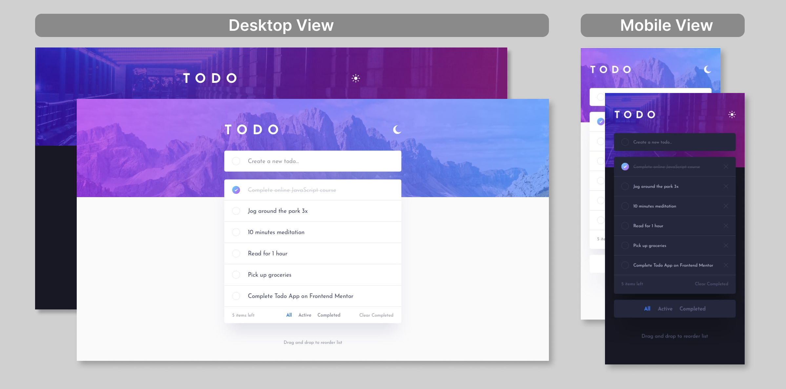

# Frontend Mentor - Todo app solution

This is a solution to the [Todo app challenge on Frontend Mentor](https://www.frontendmentor.io/challenges/todo-app-Su1_KokOW). Frontend Mentor challenges help you improve your coding skills by building realistic projects. 
**This project involves building a fully interactive and responsive Todo app with light/dark mode functionality.**

## Table of contents

- [Overview](#overview)
  - [The challenge](#the-challenge)
  - [Screenshot](#screenshot)
  - [Built with](#built-with)
  - [Links](#Links)
- [Other](#Other)

## Overview

The Todo app allows users to manage their tasks efficiently, offering features such as task addition, status tracking, filtering, and reordering, all in an accessible and responsive design.

### The challenge

Users should be able to:

- View the optimal layout for the app depending on their device's screen size
- See hover states for all interactive elements on the page
- Add new todos to the list
- Mark todos as complete
- Delete todos from the list
- Filter by all/active/complete todos
- Clear all completed todos
- Toggle light and dark mode
- **Additional**: Drag and drop to reorder items on the list

### Screenshot

### Built with

- Semantic HTML5 markup
- CSS custom properties
- Flexbox
- CSS Grid
- Mobile-first workflow
- [React](https://reactjs.org/) - JS library

### Links

- Solution URL: [https://angelineds-todo-app.netlify.app](https://angelineds-todo-app.netlify.app)

## Other

Other Projects:
- Portfolio Website - [angeline-portfolio.netlify.app](https://angeline-portfolio.netlify.app)
